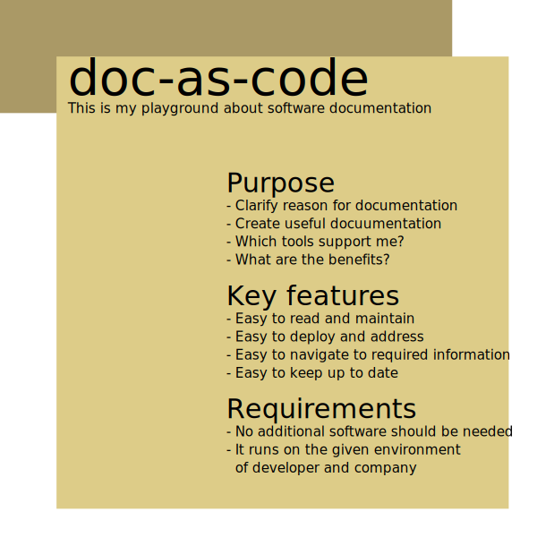

# doc-as-code
_How to document code nowadays._

This project is **my** playground about software documentation. 

 

## Audience

Since I am native German, some content will be German.
My content is addressed to software developers.

## Product box

The product box shows in a few words the main purpose of the project.
Also for whom the product is and what requirements are necessary to use it.

### Purpose 

- If you plan to add new features to the product, you can look here to see if it fits at all.
  Sometimes it is better to develop a new product instead of adding more complexity to an existing one.
- If the project is new to you, you can tell at a glance from the product box what it does.
- A gorgeous product box can be used as a recognizable logo in listings.

## Tool support

- ✎ : editable
- ✓ : properly rendered
- ✕ : not rendered

| Source \ Tool | GitHub | GitLab | BitBucket | Intellij | Visual Code | Firefox | Chrome | Outlook | Android | IOS |
|---------------|--------|--------|-----------|----------|-------------|---------|--------|---------|---------|-----|
| Markdown      | ✎      | ✎      | ✎         | ✎        | ✎           | ✕       | ✕      | ✕       | ✕       | ✕   |
| AsciiDocs     | ✎      | ✎      | ✕         | ✎        | ✎           | ✕       | ✕      | ✕       | ✕       | ✕   |
| SVG           | ✎      | ✎      |           | ✎        | ✎           | ✓       | ✓      | ✕       | ✕       | ✕   |
| JavaDoc       | ✕      | ✕      | ✕         | ✎        | ✕           |         |        |         |         |     |
| PDF           |        |        |           |          |             |         |        | ✓       | ✓       |     |
| RTF           |        |        |           |          |             |         |        | ✓       |         |     |

